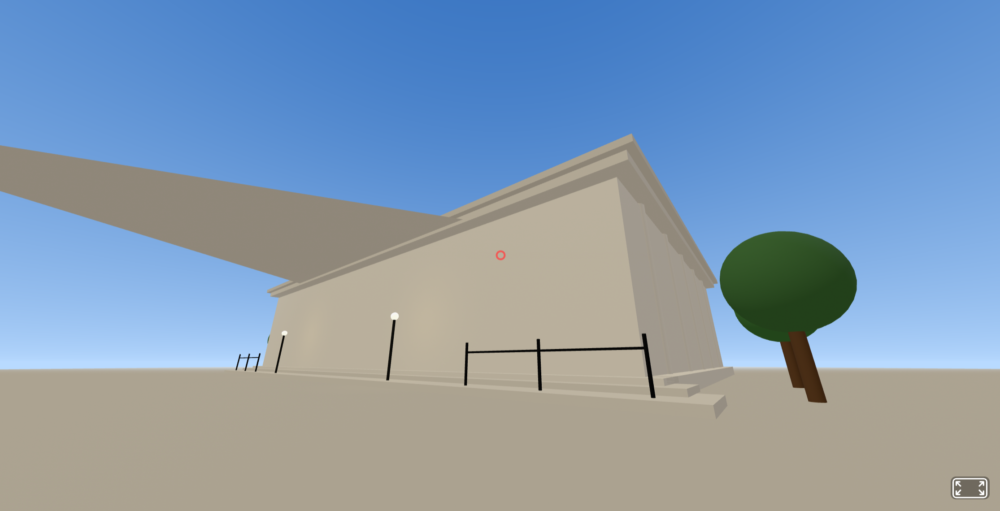
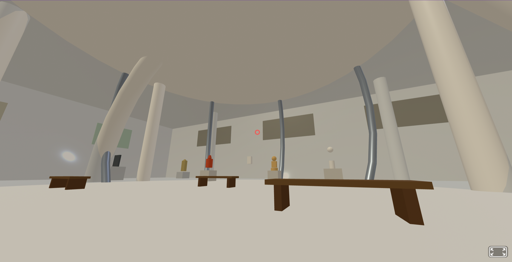

# 3D Vibe Coding

This project presents a public virtual makerspace for creative learning. Students can use 3D vibe coding to design, adapt, and explore interactive 3D environments, supporting creative expression through narrative, spatial design, visual composition, and playful problem-solving.

## Demo

[Open the 3D Vibe Coding Demo](https://hiya-world.github.io/3d-vibe-coding/)

## Project Preview

Outside view: shows the public-facing virtual makerspace environment.

Inside view: shows the interior creative space where students can explore and develop 3D ideas.

This demo shows a browser-based 3D creative space. It is intended as an example of how students can construct and explore virtual environments through vibe coding.
